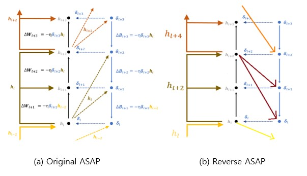
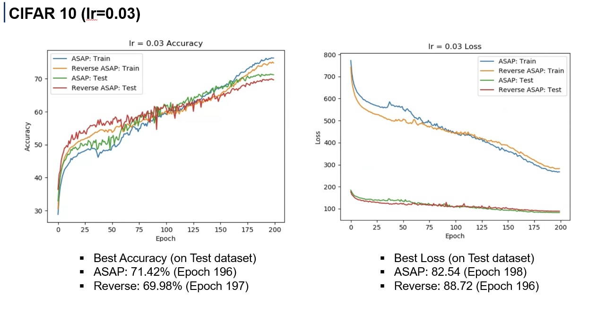

# Reverse-ASAP (RASAP)

<p align="center">
  
Image provided by courtesy of the author of [Activation Sharing Based on Asymmetric Paths (ASAP)](https://proceedings.neurips.cc/paper/2021/hash/f80ebff16ccaa9b48a0224d7c489cef4-Abstract.html)

Reverse-ASAP is an algorithm based on [Activation Sharing Based on Asymmetric Paths (ASAP)](https://proceedings.neurips.cc/paper/2021/hash/f80ebff16ccaa9b48a0224d7c489cef4-Abstract.html). While training, the shared activations/weights are from the layers in the back rather than the activations/weights of the previous layers, which was how it was implemented in the original paper. Interestingly, when the models of the same size were trained by using both RASAP and ASAP, models trained with RASAP converged slightly faster to their optimal performances compared to ones trained by original ASAP, although the optimal performances of models trained with RASAP were slightly worse. More detailed examples and explanations can be found in [Kiminha_220225.pptx](https://github.com/kiminha01/reverse_asap/blob/main/KimInha_presentation_220225.pptx)

# How to Run
The detailed instructions on how to install the packages can be found [here](https://github.com/WooSunghyeon/Activation-Sharing-with-Asymmetric-Paths).

Experiments were done by using CIFAR-10 images and the model chosen during the experiment was Alexnet (Convent). One should use the flag --convnet for the model while using the flag --asap0 or --reverse to obtain the results to compare two algorithms
For example one could train the model by using original ASAP algorithm by
```sh
python train.py --dataset cifar10 --model convnet --feedback asap0
```

#Example Result
<p align="center">

#License
[MIT](https://choosealicense.com/licenses/mit/)
